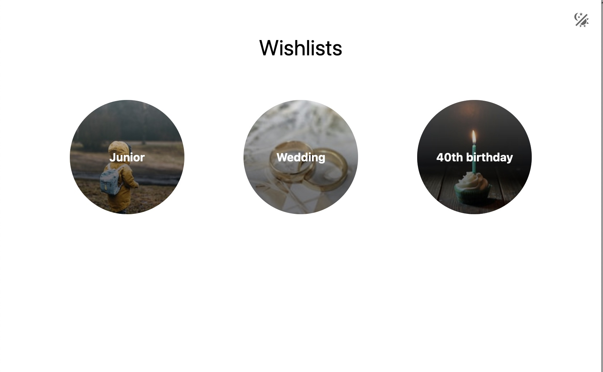
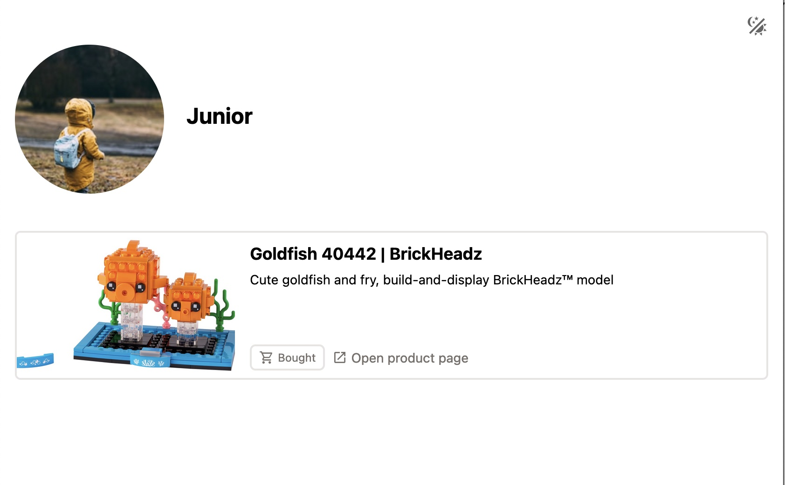
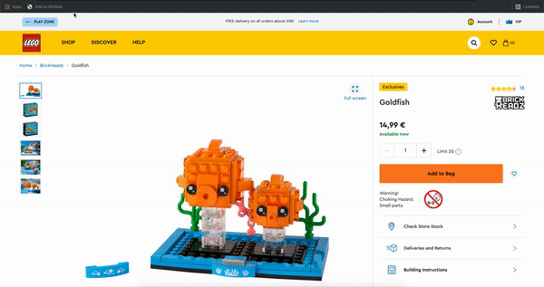

<p align="center">

</p>

<h1 align="center">
Wishlist App
</h1>
<p align="center">
  
  
  <a href="https://hub.docker.com/r/thisisbenny/wishlist-app"></a>
  
  </p>
<p align="center">
A simple webapp to manage your wishlist.
<p>
<h3 align="center">
<a href="https://codesandbox.io/s/wishlist-app-ycygh3"><i>Demo</i></a>
</h3>
<br>
<br>

The wishlist app is a simple webapp for publishing wishlists. It allows to share wishlists for different people or occasions with friends and family. If something from the wishlist was bought, it can be removed from the list to prevent duplicate purchases.

## Features

- Support of multiple wishlists
- Items can be removed from the wishlist by everyone (no registration needed for friends and family).
- Grab title, description and image-url from url via open graph meta tags
- i18n support

## Screenshots




## Install

### Docker Setup
The app can be easily installed via Docker compose. During installation, only a password (API key) and a path for the SQLite database must be specified.

```yaml
version: '3.7'

services:
  wishlist:
    image: thisisbenny/wishlist-app:latest
    environment:
      - API_KEY=TOP_SECRET
    ports:
      - '5000:5000'
    volumes:
      - ./data:/app/data
```

## Usage

When you open the app for the first time, you have to enter the API key. To do this, click the icon on the right in the header or open the `/login` page. If the API key is stored, a toggle for the edit mode appears in the header. The edit mode allows you to create new wishlists or edit existing ones.

If you want add new entries to the wishlist, open a wishlist and activate the edit mode. To more easily to add something to the wishlist, you can create a bookmark with the following content (replace [DOMAIN] with your own domain):

`javascript:window.location='[DOMAIN]/add-wishlist-item?url=' + window.location`

Now you can select the bookmark on a product page. This will redirect you to the app and pre-fill the form with the Open Graph data from the original page.




Once the wish list is ready, it can be shared with friends and family. They have the option to remove purchased items from the wish list so that they are not bought a second time.

Wishlists that have been set as non-public can only be opened with a deep link. They do not appear on the start page (unless the API key is set).

## Development Guide

```sh
npm install
npx prisma generate
npx prisma migrate deploy
```

### Compile and Hot-Reload for Development

```sh
npm run dev
```

### Type-Check, Compile and Minify for Production

```sh
npm run build
```

### Run Unit Tests

```sh
npm run test:unit
```

### Lint

```sh
npm run lint
```

### Typecheck

```sh
npm run typecheck
```

## Other stuff

[](https://www.buymeacoffee.com/hierlDev)
