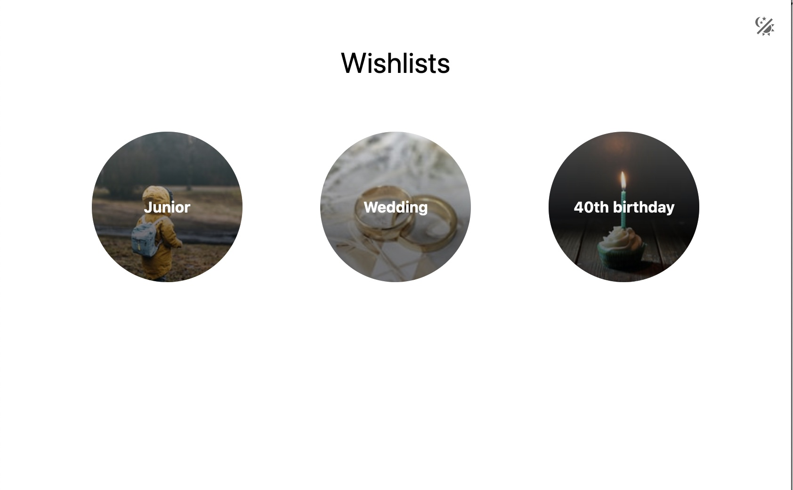
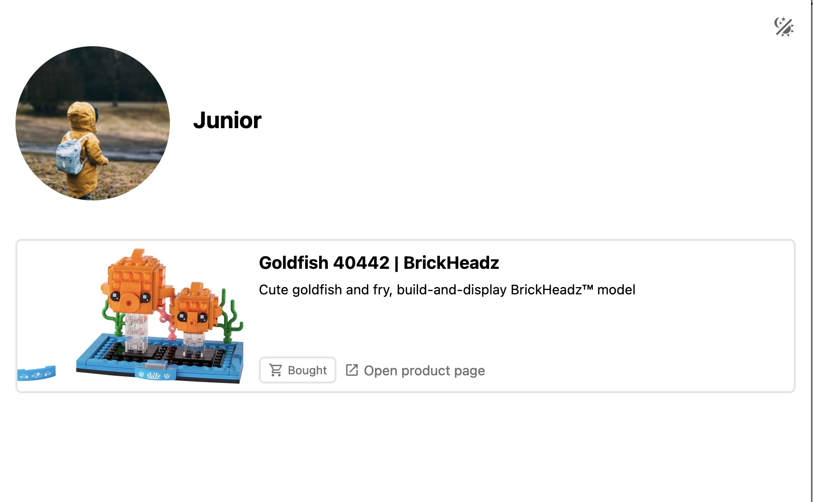

<p align="center">

</p>

<h1 align="center">
Wishlist App
</h1>
<p align="center">
  
  
  <a href="https://hub.docker.com/r/thisisbenny/wishlist-app"></a>
  
</p>

A simple webapp to manage your wishlists. Share them with friends and family, and let them mark items as purchased.

## Features

- **Multiple Wishlists**: Create and manage unlimited wishlists
- **Open Graph Metadata**: Automatically fetch title, description and images from product URLs
- **Public/Private Lists**: Control which lists appear on the homepage
- **Item Tracking**: Mark items as purchased to prevent duplicate gifts
- **Dark Mode**: Built-in dark theme support
- **i18n**: Available in English and German

## Screenshots




## Quick Start

### Docker (Recommended)

```yaml
version: '3.7'

services:
  wishlist:
    image: thisisbenny/wishlist-app:latest
    environment:
      - API_KEY=TOP_SECRET
    ports:
      - '5000:5000'
    volumes:
      - ./data:/app/data
```

### Manual Setup

```bash
# Install dependencies
npm install

# Setup environment
cp .env.template .env

# Initialize database
npx prisma generate
npx prisma migrate deploy

# Start development server
npm run dev
```

Visit http://localhost:5173

## Usage

### First Login

1. Click the login icon in the header (top-right)
2. Enter your API key (default: `TOP_SECRET`)
3. A toggle for edit mode will appear

### Creating Wishlists

1. Activate edit mode (toggle in header)
2. Click the "+" tile to create a new wishlist
3. Fill in title, description, and choose public/private

### Adding Items

1. Open any wishlist
2. Activate edit mode
3. Add items manually or use the bookmarklet

### Bookmarklet

Create a bookmark with this JavaScript to quickly add items:

```javascript
javascript: window.location =
  'http://localhost:5000/add-wishlist-item?url=' + window.location
```

### Sharing

Share wishlists via their unique URLs. Friends and family can mark items as purchased without needing the API key.

## Development

### Commands

| Command             | Description              |
| ------------------- | ------------------------ |
| `npm run dev`       | Start frontend + backend |
| `npm run build`     | Build for production     |
| `npm run test:e2e`  | Run E2E tests            |
| `npm run lint`      | Lint code                |
| `npm run typecheck` | Type check               |

See [DEVELOPER.md](DEVELOPER.md) for complete documentation.

## API

The app exposes a REST API. See [API.md](API.md) for complete API documentation.

### Example: Get Public Wishlists

```bash
curl http://localhost:5000/api/wishlist
```

### Example: Mark Item as Bought

```bash
curl -X POST http://localhost:5000/api/wishlist/{id}/item/{itemId}/bought
```

## Tech Stack

- **Frontend**: Vue 3, Vue Router, Vue I18n, Tailwind CSS
- **Backend**: Fastify, Prisma, SQLite
- **Testing**: Vitest, Playwright

## License

MIT
